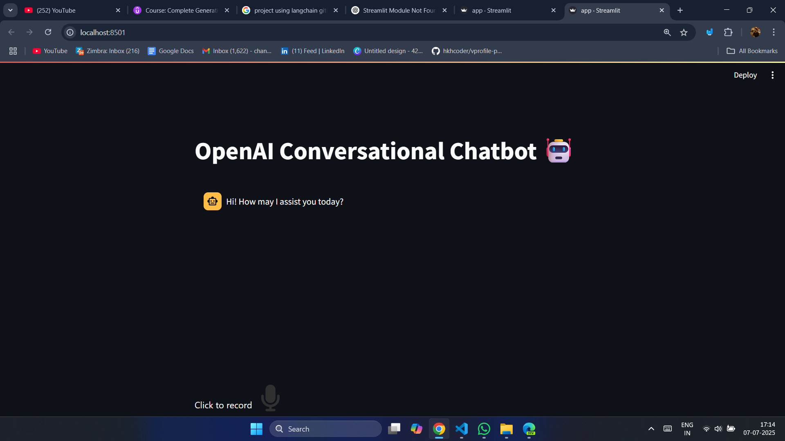

## Building a Conversational Voice Chatbot: Integrating OpenAI's Speech-to-Text & Text-to-Speech

### Table of Contents

- [Introduction](#introduction)
- [Setting Up the Environment](#setting-up-the-environment)
  - [1. Install Required Libraries](#1-install-required-libraries)
  - [2. Set Up the .env File](#2-set-up-the-env-file)
  - [3. Understanding the Project Structure](#3-understanding-the-project-structure)
- [Building the Chatbot: Streamlit Interface (app.py)](#building-the-chatbot-streamlit-interface-apppy)
  - [Streamlit Interface Setup](#streamlit-interface-setup)
  - [Handling Voice Inputs](#handling-voice-inputs)
  - [Chatbot Response Processing](#chatbot-response-processing)
- [Integrating OpenAI's Services (utils.py)](#integrating-openais-services-utilspy)
  - [speech_to_text Function](#speech_to_text-function)
  - [text_to_speech Function](#text_to_speech-function)
  - [get_answer Function](#get_answer-function)
- [Chatbot Interaction Flow](#chatbot-interaction-flow)
- [Conclusion](#conclusion)
  - [Reflecting on the Project](#reflecting-on-the-project)
  - [Additional Resources](#additional-resources)

  ### 🖥️ Chatbot Interface

  

